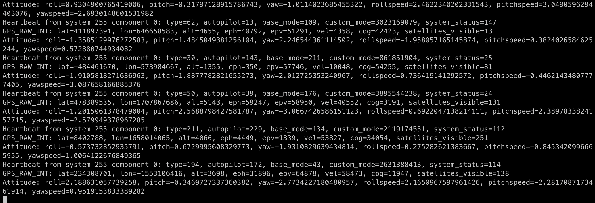

# Mavlink Sim
I wanted to learn more about Mavlink so with the help of ChatGPT I pulled the following project together.

# Dependencies
* python
* socat
* pymavlink

## Initialize environment

```bash
python -m venv .venv
source ./.venv/bin/activate
pip install -r requirements.txt
```

## Running the Setup

Start the Mavlink Simulator:
```bash
source ./.venv/bin/activate
python mavlink_simulator.py
```

Run the socat Command:
```bash
socat -u UDP-RECV:14550 TCP-LISTEN:14551
```

In another terminal, run the Python Script:
```bash
source ./.venv/bin/activate
python read_mavlink_messages.py
```


## References
* https://www.samba.org/tridge/UAV/pymavlink/apidocs/mavlink.MAVLink.html
* https://mavlink.io/en/mavgen_python/